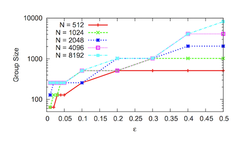

# Distributed Hash Tables (DHT) Application to Blockchain

## Introduction

A DHT is an [overlay network](https://en.wikipedia.org/wiki/Overlay_network) connected by
virtual links in the underlying network. It provides a lookup and key/value service where
responsibility for maintaining the mapping is distributed across participating nodes.

Image from [XKCD #350 - Network](https://xkcd.com/350/) - [License](https://xkcd.com/license.html)

## Contents

- [Distributed Hash Tables (DHT) Application to Block Chain](#distributed-hash-tables--dht--application-to-block-chain)
  - [Introduction](#introduction)
  - [Contents](#contents)
  - [What kinds of problems do DHTs solve?](#what-kinds-of-problems-do-dhts-solve-)
  - [Comparison of DHT algorithms](#comparison-of-dht-algorithms)
    - [Chord](#chord)
    - [Kademlia](#kademlia)
    - [test](#test)
  - [DHTs in the wild](#dhts-in-the-wild)
  - [Attacks](#attacks)
    - [Join-Leave (Eclipse) attack](#join-leave--eclipse--attack)
    - [Sybil attack](#sybil-attack)
    - [Techniques for attack mitigation](#techniques-for-attack-mitigation)
      - [Cuckoo Rule](#cuckoo-rule)
  - [References](#references)
  - [Contributors](#contributors)
  - [Appendices](#appendices)

## Characterization of DHT networks

### Peer Discovery

Peer discovery is the process of locating nodes in a distributed network for data communication.
This is facilitated by every node maintaining a list of peers, called a routing table, and sharing
that list with other nodes on the network. In DHTs, only a subset of peer nodes are required to be maintained
and shared by an individual node.

As peers come and go, routing tables are repeatedly updated to ensure network integrity.

DHTs have largely made the use of centralized trackers redundant.

### Scalability and Fault-Tolerance

A DHT network efficiently distributes responsibility for the replicated storage and retrieval of routing information
and data. This distribution allows nodes to join and leave with minimal or no disruption. The network can
have a massive number of nodes (in the case of BitTorrent millions of nodes) without each node having to
know about every other participant in the network.

In this way, DHTs are inherently more resilient against hostile attackers then a typical centralized system. [[1]]

### Distributed Data Storage

Arbitrary data may be stored and replicated by a subset of nodes for later retrieval. Data is hashed using a
consistent hashing function (such as SHA256) to produce a key for the data. That data is propagated and
eventually stored on the node or nodes whose node IDs are "closer" to the key for that data for some distance
function.

Partitioned data storage has limited usefulness to a typical blockchain as each full-node is required to keep a copy
of all transactions and blocks for verification.

## Features of DHTs

There are two main features provided by DHTs:

### Overlay Network

A communication network built on top of another network. The internet is one example which began as an overlay
network on the public switched telephone network.

In the case of DHTs, some protocol is used to ask nodes to accept your node in their routing tables within the
applicable keyspace, and allows your node to participate in the DHT overlay network.

### Abstract Keyspaces

A node and data on the network are identified by an opaque key or set of keys within an abstract keyspace. [[1]]
Typically, a long random 160-bit string.

## DHT algorithms

The following summarizes the available DHT algorithms. Degree is the number of neighbors with which a node must maintain contact.

| Algorithm            | Year | Degree              | Max. Lookup Hops                    | Implementations                              |
| -------------------- | ---- | ------------------- | ----------------------------------- | -------------------------------------------- |
| Chord (basic query)  | 2001 | $\mathbb O(1)$      | $\mathbb O(n)$                      |                                              |
| Chord (finger table) | 2001 | $\mathbb O(log(n))$ | $\mathbb O(log(n))$                 | OpenChord                                    |
| Kademlia             | 2002 | $\mathbb O(log(n))$ | $\mathbb O(log(n))$                 | Ethereum [3], Mainline DHT (BitTorrent), I2P |
| Koorde               | 2004 | $\mathbb O(log(n))$ | $\mathbb O(log(n) / {log(log(n))})$ |                                              |
| Pastry               | 2001 | $\mathbb O(log(n))$ | $\mathbb O(log(n))$                 | FreePastry                                   |
| Tapestry             | 2004 | $\mathbb O(log(n))$ | $\mathbb O(log(n))$                 | OceanStore, Mnemosyne [4]                    |

_Koorde_ requires less hops than other DHTs, however the author was not able to find any successful implementations. This could
be due to the higher complexity to gain in performance ratio. Therefore, the rest of this section will discuss the most
popular, optimized DHT variant [[1]] with many successful implementations, called **Kademlia**.

### Kademlia

Kademlia is designed to be an efficient means for storing and finding content in a distributed P2P network.
It has a number of core features not simultaneously offered by other DHTs [[2]], such as:

- Minimizing the number of configurations messages necessary for nodes to learn about each other
- Nodes have enough information to route traffic through low latency paths
- Parallel and asynchronous queries to avoid timeout delays from failed nodes
- The node existence algorithm resists certain basic DoS attacks

#### NodeID

As with most other DHTs, a node selects an n-bit ID which is opaque to other nodes on the network.
The network design relies on node IDs being uniformly distributed by some random procedure.
A nodes position is determined by the shortest unique prefix of it's ID, which forms a tree
structure with node IDs as leaves. [[2]]

graph TD
AR[ ] --- |0| A0( )
AR --- |1| A1[ ]
A0 --- |0| A00[ ]
A0 --- |1| A01[ ]
A00 --- |0| N000[Node 000]
A00 --- |1| N001[Node 001]
A01 --- |0| N010[Node 010]
A01 --- |1| N011[Node 011]
A1 --- |0| A10[ ]
A1 --- |1| A11[ ]
A10 --- |0| A100[Node 100]
A10 --- |1| A101[Node 101]
A11 --- |0| A110[Node 110]
A11 --- |1| A111[Node 111]

_Fig 1. Binary tree structure in a 3-bit key space._

A sufficiently large keyspace should be chosen such that node ID collisions are extremely unlikely.
160-bits is recommended as a suitable keyspace size for Kademlia. [[2]]

#### XOR metric

Distance between node IDs $a$ and $b$ is defined using the XOR ($\oplus$) metric.

$$ distance(a, b) = a \oplus b$$

XOR is a valid distance metric because [[1]]:

- $a \oplus a = 0$
- $a \oplus b > 0$ for $a \neq b$
- $a \oplus b = b \oplus a$
- Triangle property: $a \oplus b + b \oplus c \geq a \oplus c$

The XOR metric captures a notion of distance implied in the tree structure above. [[2]]

#### $k$-buckets

Each node organizes contact in lists of size $k$, aptly named $k$-buckets. Each node partitions
peers into these buckets based on their XOR distance from the node. Such that, for bucket $j$,
where $0 <= j < k$, there is at least one peer stored for which

$$ 2^j <= distance(node, contact) < 2^{(j+1)} $$

Peers within $k$-buckets are sorted from least to most recently seen. As more nodes are discovered through
RPC requests, they are inserted to the appropriate bucket until it's size is $k$. $k$ is a network-wide
parameter which is chosen to make it very unlikely that all $k$ nodes will be unavailable, for example $k = 20$.

Once a node receives a request or reply from a peer, it checks to see if the peer is contained in the
appropriate $k$-bucket. Depending on if the peer already exists or not, the entry is either moved or appended to the
tail of the list (most recently seen). If a particular bucket is already size $k$, the node tries to `PING` the first
peer in the list (least recently seen). If the peer does not respond, it is evicted and the new peer is
appended to the bucket, otherwise the new peer is discarded. This algorithm is biased towards peers which are
long-lived and highly available.

#### Protocol

The following RPC messages form part of the Kademlia protocol:

- `PING`/`PONG` - Used to determine liveness of a peer

- `STORE` - Request to store a $\langle key, value \rangle$ pair

- `FIND_NODE` - Returns at most $k$ nodes which are closer to a given query value

- `FIND_VALUE` - Behaves the same as `FIND_NODE` by returning the $k$ closest nodes. If node has the requested key value pair,
  it will instead return the stored value.

#### Bootstrapping and Joining the Network

A node wishing to join the network for the first time has no contacts in their $k$-buckets. In order for the node to establish
itself on the network, it must contact one or more bootstrap nodes. These nodes are not necessarily special in any way. They
simply serve as a first point of contact for the requesting node to become known to the rest of the network and to find their
closest peers.

There are a number of ways that bootstrap nodes can be obtained, including adding addresses in code or in a configuration,
or using [DNS seeds](https://bitcoin.org/en/glossary/dns-seed).

In order to join, the new node:

1. adds the bootstrap nodes to the appropriate $k$-bucket;
2. generates a new random node ID;
3. sends a lookup request of it's generated node ID to the bootstrap nodes.

This _self-lookup_ has two effects: it allows the node to learn about nodes closer to itself and it populates other nodes
$k$-buckets with the nodes ID. [[1]]

## Vulnerabilities and Attacks

### Eclipse Attack

An attack which allows adversarial nodes to isolate the victim from the rest of it's peers and filter it's view of the rest of the
network. If the attacker is able to occupy all peer connections, the victim is eclipsed.

The cost of executing an eclipse attack is highly dependant on the architecture of the network and can range from a small number of machines
(e.g with hundreds of node instances on a single machine) to requiring a full-fledged botnet. In a 2018 paper entitled "Low-Resource Eclipse Attacks
on Ethereum’s Peer-to-Peer Network" [[6]], Marcus Heilman Goldberg show that an eclipse attack on Ethereum's Kademlia-based DHT can be
executed using as little as two nodes.

Mitigations include:

- Identities must be obtained independently from some random oracle
- Nodes maintain contact with nodes outside of their current network placement

### Sybil Attack

Sybil attacks are an attempt by colluding nodes to gain disproportionate control of a network and are often used as a vector
for other attacks. Many if not all DHTs have been designed under the assumption that a low fraction of nodes are malicious.
A Sybil attack attempts to break this assumption by increasing the number of malicious nodes.

Mitigations include:

- Associating a cost with adding new identifiers to the network
- Reliably joining real-world identifiers (such as an IP address, MAC address etc) to the node identifier, and rejecting a threshold of of duplicates
- A trusted central authority which issues identities
- Using social information and trust relationships

### Adaptive Join-Leave Attack

An adversary wants to populate a particular keyspace interval $I$ with bad nodes, let's say in order to prevent a particular file
from being shared. Let's suppose that we have a network with node IDs chosen completely at random. An adversary starts by executing
join/leaves until it has nodes in that keyspace. After that they proceed in rounds, keeping the nodes that are in $I$ and rejoining
the nodes that aren't.

The Cuckoo Rule [[5]] and Commensal Cuckoo Rule [[7]] have been proposed rules to prevent this attack and are covered below. [Cuckoo Rule](#cuckoo-rule)

## Cuckoo Rule

The cuckoo rule is a join rule which moves (cuckoos) nodes in the same group (or interval) as the joining node to
random locations outside of the group.

Their adversarial model is as described above in [Adaptive join-leave attacks](#adaptive-join-leave-attack).

Given:

- $I$ - keyspace interval or group in $[0,1)$
- $n$ - the number of honest nodes
- $ \epsilon n$ - the number adversarial nodes for constant $\epsilon < 1$
- therefore, the network size $N$ is $n + \epsilon n$

And with the following two conditions:

- _Balancing Condition_: The interval $I$ contains at least $ \mathbb O(log(n))$ nodes
- _Majority Condition_: honest nodes are in the majority in $I$

The cuckoo rule is as follows:

_If a new node $v$ wants to join the system, pick a random $x \in [0, 1)$. Place $v$ into $x$ and move
all nodes in $R_k(x)$ to points in $[0, 1)$ chosen uniformly and independently at random (without replacing any
further nodes)._ [[5]]

It is concluded that if $\epsilon < 1 - 1/k$ for $k > 1$ is sufficient to prevent adaptive join-leave attacks by a constant
fraction of adversarial peers.

### Commensal Cuckoo Rule

TODO: summarize

Sen, Freedman [[7]] modelled and analysed the Cuckoo Rule

|                                                                                                                                                                                               |     |                                                                                                                                                                                                                                                              |
| :-------------------------------------------------------------------------------------------------------------------------------------------------------------------------------------------: | :-: | :----------------------------------------------------------------------------------------------------------------------------------------------------------------------------------------------------------------------------------------------------------: |
|                                                                                                                             |     |                                                                                                                                                                                            |
| _Figure 1: (Cuckoo rule) Minimum group size  needed to tolerate different $\epsilon$ for 100,000 rounds. Groups must be large (i.e., 100s to 1000s of nodes) to guarantee correctness._ |     | Figure 2: (Cuckoo rule) Number of rounds the system maintained correctness with an average group  size of 64 nodes, for varied. Simulation was halted  after 100,000 rounds. Failure rates drop dramatically past a certain threshold for different N. |

Commensal cuckoo rule. When a new node wants to join
the system, pick a random x ∈ [0, 1). If the group containing
x has not received at least k − 1 secondary joins since its
last primary join, start over with a new random x ∈ [0, 1).
Otherwise, place the node at x and move (cuckoo) kg0
/g
random nodes in the group to random locations in [0, 1),
where g
0
is the group’s current size and g is the average
group size.

## References

[[1]] Wikipedia: Distributed hash table https://en.wikipedia.org/wiki/Distributed_hash_table. Date accessed: 2019-03-08

[1]: https://en.wikipedia.org/wiki/Distributed_hash_table. 'Wikipedia: Distributed Hash Table'

[[2]] Kademlia: A Peer-to-peer Information System https://pdos.csail.mit.edu/~petar/papers/maymounkov-kademlia-lncs.pdf Date accessed: 2019-03-08

[2]: https://pdos.csail.mit.edu/~petar/papers/maymounkov-kademlia-lncs.pdf 'Original Kademlia paper'

[[3]] Ethereum Wiki https://github.com/ethereum/wiki/wiki/Kademlia-Peer-Selection#lookup. Date accessed: 2019-03-12

[3]: https://github.com/ethereum/wiki/wiki/Kademlia-Peer-Selection 'Kademlia Peer Selection'

[[4]] Wikipedia: Tapestry (DHT) https://www.wikiwand.com/en/Tapestry_(DHT). Date accessed: 2019-03-12

[4]: https://www.wikiwand.com/en/Tapestry_(DHT) 'Tapestry (DHT)'

[[5]] Towards a Scalable and Robust DHT http://www.cs.jhu.edu/~baruch/RESEARCH/Research_areas/Peer-to-Peer/2006_SPAA/virtual5.pdf. Date accessed: 2019-03-12

[5]: http://www.cs.jhu.edu/~baruch/RESEARCH/Research_areas/Peer-to-Peer/2006_SPAA/virtual5.pdf 'Towards a Scalable and Robust DHT'

[[6]] Low-Resource Eclipse Attacks on Ethereum’s Peer-to-Peer Network https://www.cs.bu.edu/~goldbe/projects/eclipseEth.pdf Date accessed: 2019-03-15

[6]: https://www.cs.bu.edu/~goldbe/projects/eclipseEth.pdf 'Low-Resource Eclipse Attacks on Ethereum’s Peer-to-Peer Network'

[[7]]: Commensal Cuckoo: Secure Group Partitioning for Large-Scale Services http://sns.cs.princeton.edu/docs/ccuckoo-ladis11.pdf Date accessed: 2019-03-15

[7]: http://sns.cs.princeton.edu/docs/ccuckoo-ladis11.pdf 'Commensal Cuckoo: Secure Group Partitioning for Large-Scale Services'

## Contributors

https://github.com/sdbondi

https://github.com/hansieodendaal

## Appendices
